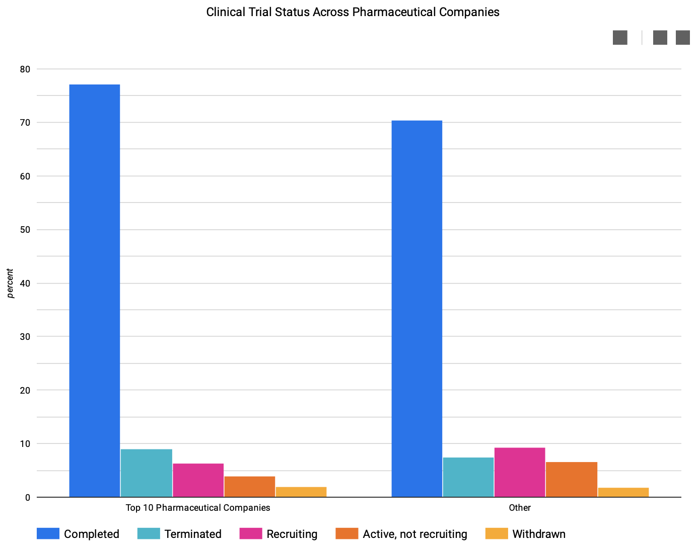
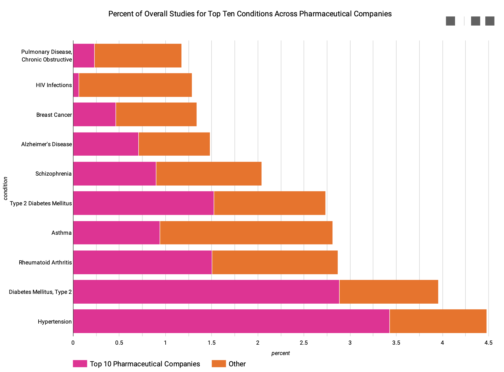
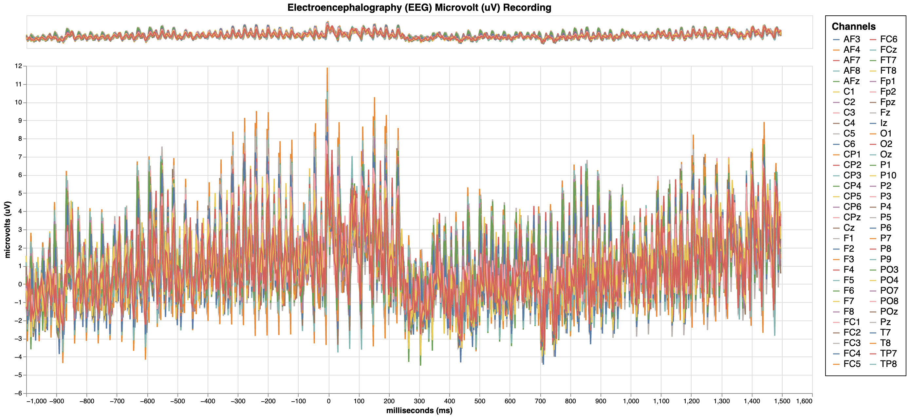

# Portfolio 

## National Institutes of Health (NIH) Clinical Trials Analysis
- Modeled 15+ tables with over 700,000 records using BigQuery
- Created a workflow using Google Apache Beam & Airflow to strategically process data 
- Generated entity relationship diagrams (ERD) and dashboards to display insights

  
   

## Electroencephalograph (EEG) Visualization
- Confirmed the absence of "bad" channels using Python's MNE package 
- Employed Principal Component Analysis (PCA) as a dimension reductinality measure 
- Performed Guassian Mixture Model clustering to aggregate channels with similar activity 
- Created an interactive dashboard with the use of Altair 

  

## Texas State Patrol: Traffic Stop Search Analysis/Classification
