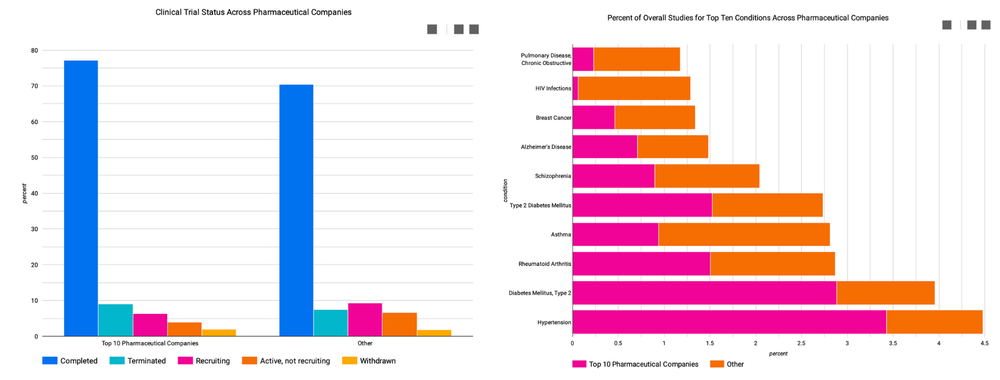

# Portfolio 

---

## [National Institutes of Health (NIH) Clinical Trials Analysis](https://github.com/abelasandovalg/clinical-trials)
- Modeled 15+ tables with over 700,000 records using Google BigQuery
- Created a workflow using Google Apache Beam & Airflow to strategically process data 
- Generated entity relationship diagrams (ERD) and dashboards to display insights using Google Data Studio

  

---

## [Electroencephalograph (EEG) Visualization](https://github.com/abelasandovalg/eeg)
- Confirmed the absence of "bad" channels using Python's MNE package 
- Employed Principal Component Analysis (PCA) as a dimension reductionality measure 
- Performed Guassian Mixture Model clustering to aggregate channels with similar activity
- Created an interactive dashboard with the use of Altair 

  

---

## [Texas State Patrol: Traffic Stop Search Classification](https://github.com/abelasandovalg/police-search)
- Feature engineered new columns from existing data 
- Resampled data using RandomOverSampler and RandomUnderSampler
- Bulit and trained Decision Tree, Random Forest, and AdaBoost classifiers
- Optimized Decision Tree classifier using GridSearchCV to find the best model

  

---

## Coursework 

### [Elements of Data Analytics](https://github.com/abelasandovalg/analytics)
### [Elements of Data Visualization](https://github.com/abelasandovalg/visualization)
